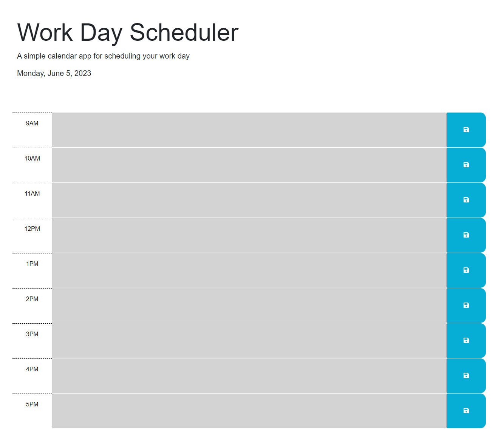

# Day Planner using DayJS, Jquery and Bootstrap 

## Description

This is a refactoring exercise designed to show a use of various API's to create a funtional day planner. Baseline HTML, CSS was provided by the bootcamp course. 

## Installation

No installation is required. You can run this index file through VS code or chosen code editor.

## Usage

While this screenshot does a poor job showing you anything color related due to the time of day check I assure you it does function. Go ahead and enter text into the field, and hit the save icon. Then, reload the page to check and see the input information is still there.  there will also be a confirmation on screen that shows you saved. 

    

    

## Credits
"Format." DayJS, day.js.org/docs/en/display/format. Accessed 3 Jun. 2023.
"JQuery Syntax." W3 Schools, www.w3schools.com/jquery/jquery_syntax.asp. Accessed 3 Jun. 2023.
"HTML i Tag." W3 Schools, www.w3schools.com/tags/tag_i.asp. Accessed 3 Jun. 2023.
"Containers." Bootstrap, getbootstrap.com/docs/5.3/layout/containers/. Accessed 3 Jun. 2023.
"Columns." Bootstrap, getbootstrap.com/docs/5.3/layout/columns/. Accessed 3 Jun. 2023.

## License

MIT License

Copyright (c) [2023] [Cody Cooke]

Permission is hereby granted, free of charge, to any person obtaining a copy
of this software and associated documentation files (the "Software"), to deal
in the Software without restriction, including without limitation the rights
to use, copy, modify, merge, publish, distribute, sublicense, and/or sell
copies of the Software, and to permit persons to whom the Software is
furnished to do so, subject to the following conditions:

The above copyright notice and this permission notice shall be included in all
copies or substantial portions of the Software.

THE SOFTWARE IS PROVIDED "AS IS", WITHOUT WARRANTY OF ANY KIND, EXPRESS OR
IMPLIED, INCLUDING BUT NOT LIMITED TO THE WARRANTIES OF MERCHANTABILITY,
FITNESS FOR A PARTICULAR PURPOSE AND NONINFRINGEMENT. IN NO EVENT SHALL THE
AUTHORS OR COPYRIGHT HOLDERS BE LIABLE FOR ANY CLAIM, DAMAGES OR OTHER
LIABILITY, WHETHER IN AN ACTION OF CONTRACT, TORT OR OTHERWISE, ARISING FROM,
OUT OF OR IN CONNECTION WITH THE SOFTWARE OR THE USE OR OTHER DEALINGS IN THE
SOFTWARE.